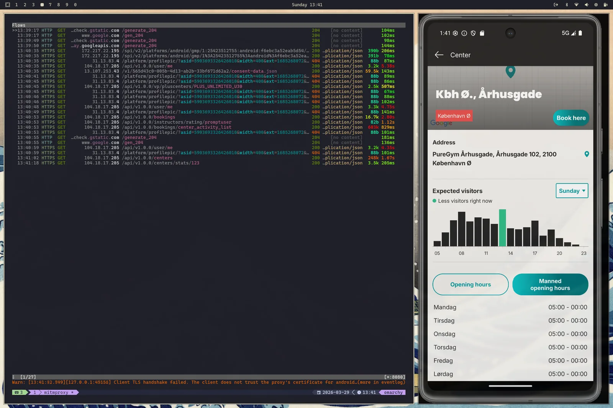

+++
title = "Building a PureGym MCP server"
date = 2026-03-30T20:00:00+02:00
draft = false
+++

I have spent the last few a
[Model Context Protocol server](https://modelcontextprotocol.io/docs/getting-started/intro) exposing PureGym's
functionality.

The project is called [puregym-mcp](https://github.com/JorgeSintes/puregym-mcp). It exposes structured tools
to search classes, list centers, inspect bookings, check live center status and opening hours, and, when
credentials are configured, book or cancel classes. It even has a
[landing page](https://puregym-mcp.jorgesintes.dev)!

Before getting into the story, here is the current package in action, using Mistral's
[Le Chat](https://chat.mistral.ai/chat):



---

This post is about why I built it, how it evolved from a more bot-shaped thing into an MCP server _hopefully_
useful to someone else than me, and what it taught me about the current state of AI tooling in the real world.

Before we start: this is an independent third-party project and is **not** affiliated with, endorsed by, or
sponsored by PureGym. PureGym is a registered trademark of PureGym Limited.

## It started with a very normal problem

Don't be fooled: the most annoying part of being a Spaniard living in Denmark is not the weather or the food.
It's not even trying to pronounce _rødgrød med fløde_ without choking. It's the **obsession** around
scheduling.

Perhaps it's not Denmark's fault, and it's just an aspect of adult life I have difficulty coping with, but
here, everyone schedules **way** in advance, be it meeting with friends, going out to discos, concerts... And
also: gym classes.

At my [gym](https://puregym.dk) (not sponsored by them in any way or form), you can book classes up to a month
in advance, and keep as many as 18 bookings at once. In practice, that means the popular classes are often
taken well before the week they happen.

So the game becomes: book early enough to get the classes you might want, then remember what you've booked,
and cancel in time if plans change so you do not get charged a fee. I am definitely not built for this.
Whenever I tried, I either booked too late and didn't get a spot, or forgot I had booked at all. I ended up
not going to classes **at all**, paying more in no-show fees than a month's subscription, while also blocking
spots someone else might have used.

Finally, I got tired and did the obvious, reasonable, totally sane thing: built a
[Telegram bot](https://github.com/JorgeSintes/puregym-bot) that books for me, sends me reminders about the
classes I booked, and lets me manage the bookings from the notification itself.
[Noice](https://www.youtube.com/watch?v=h3uBr0CCm58).

And once I had the API layer somewhat figured out, I gave in to the LLM-hype and decided to expose that to an
AI client via MCP.

## The reverse-engineering detour

The first version of the MCP used the same web API you use when you search for classes and book through the
web. That worked, but it had problems: the auth cycle is **terribly** slow, and some endpoints relied on
parsing the HTML site, making the whole setup brittle. Plus, there's some functionality in the app that's just
not available on the web, like live center occupancy and expected occupancy by hour throughout the week. In
the end, getting visibility into what the mobile app was actually doing became the hardest part of the
project.

First thing I thought: **man in the middle**. Maybe those YouTube VPN ads with some guy in a hoodie sitting in
an Espresso House waiting to steal your bitcoin over public WiFi had actually been trying to prepare me for
this moment.

So, I downloaded [mitmproxy](https://www.mitmproxy.org/) on my laptop, and set my phone to use my computer as
a proxy in the WiFi settings. After that, I had to install its certificate on the phone, otherwise it would
reject every HTTPS request. And the browser worked! The PureGym app, however, didn't want to, and refused to
connect.

After a bit of reading, I found that some apps trust certificates installed in the system trust store, which
you can do modify in a rooted phone. So, I took the old phone I had from
[this other project](/posts/precisely_syncing_an_android_phones_system_clock_to_a_computers_clock_using_adb/)
and tried it out with [Magisk](https://topjohnwu.github.io/Magisk/). Aaaaand... no luck. The phone was too old
and kept erroring on installs of the app, the certificates, couldn't even access websites through the proxy.

Later, inspired by [this article](https://docs.mitmproxy.org/stable/howto/install-system-trusted-ca-android/),
I tried to emulate a rooted Android device. That worked, I could install the mitmproxy certificates in the
system and it worked fine. But PureGym **still** wouldn't budge. Allow me to introduce the concept of
**certificate pinning**, where the application or device has a preconfigured list of public keys or
certificates that it explicitly trusts, specifically to prevent MITM attacks.

It seems PureGym is doing this. Great, just great. I got to the point where even ChatGPT was telling me to
just accept defeat and go live my life checking center status in the app like a normal person. How dare
he/she/it!

### Accepting defeat... Or not?

Reading further, I stumbled upon [Frida](https://frida.re/docs/home/), which seemed like exactly what I
needed. I went ahead, installed it on my rooted emulated device, and tried out a
[code snippet](https://codeshare.frida.re/@Q0120S/bypass-ssl-pinning/) to bypass SSL pinning and... Voilà!



I could then move through the app and check the endpoints it was using. I had **the precious internal API
endpoints** and I could then go ahead and build the richer parts of the package. VICTORY!

## The actual MCP

Once I had the internal API mapped out, the rest of the package became much more straightforward. I upgraded
most of the brittle web-facing calls to the richer internal API, which made the whole thing **faster, more
stable, and more capable** than the original web-based approach.

From there, building the MCP layer itself was pleasantly smooth. I used the
[official MCP Python SDK](https://github.com/modelcontextprotocol/python-sdk), which made exposing the package
as a proper tool server surprisingly simple.

PureGym credentials are provided through two environment variables. Without them, the MCP stays in an
anonymous read-only mode and exposes public class and center information. When credentials are configured, it
unlocks booking management, upcoming bookings, and the richer account-specific features.

### STDIO transport

Local usage through the `stdio` transport is still the **recommended and more secure option**. This is the
[OpenCode](https://opencode.ai/) configuration, and chances are your client of choice uses something very
similar:

```json
{
  "mcp": {
    "puregym": {
      "enabled": true,
      "type": "local",
      "command": ["uvx", "puregym-mcp"],
      // optional environment variables for authenticated features
      "environment": {
        "PUREGYM_USERNAME": "your-username",
        "PUREGYM_PASSWORD": "your-password"
      }
    }
  }
}
```

That works great for tools like OpenCode, Claude Code, VSCode, Codex, OpenClaw, and the list keeps growing.
You add a small config block and off you go, especially if you already use [uv](https://docs.astral.sh/uv/).

But hold on, wasn't the video showing the web version of **Le Chat** using it? Yup, it was. And that brings us
to the other transport layers:

### Remote MCP

The server is also accessible over `streamable-http` and `sse`, so you can host it behind a URL and let remote
clients consume it. That is great and all right up until you remember that your hosted PureGym MCP is now
reachable by someone more than just you.

You can, of course, serve it unauthenticated without the booking functionality. I am hosting one you can use
freely at . It is intentionally anonymous and
read-only, and if it does not meet your expectations, I am pleased to offer a 100% money-back guarantee.

### Auth

MCP clients usually support a few different authentication modes:

- **No auth** (duh).
- **HTTP Bearer token / Basic Auth**: send either a token or credentials in the `Authorization` header of each
  request.
- **OAuth 2.1** (sometimes with Dynamic Client Registration).

Since the
[MCP Docs](https://modelcontextprotocol.io/docs/tutorials/security/authorization#implementation-example) push
you in the direction of setting up OAuth 2.1 with [Keycloak](https://www.keycloak.org/) as an authorization
server, I gave it a try. Halfway through the configuration, though, I had yet another one of those moments of
"Man, what am I doing with my life?": this server is meant to host one user only, and provide that user with
their own PureGym functionality.

So, with a bit of prompting (and some reviewing too - Kimi2.5 is too reckless and didn't care about
[timing attacks](https://fastapi.tiangolo.com/advanced/security/http-basic-auth/#timing-attacks)), I got the
authentication in place. Now, if you try to run the MCP server with PureGym credentials, it will **scream at
you** if you don't provide it a token too.

Once you have the server running, you can point your client at it with something along the lines of (again,
this is for OpenCode):

```json
{
  "mcp": {
    "puregym": {
      "type": "remote",
      "url": "https://your-server.com/mcp",
      "enabled": true,
      "oauth": false,
      // This is only needed for using the authenticated endpoint
      "headers": {
        "Authorization": "Bearer <your-token>"
      }
    }
  }
}
```

## If you want to try it

The project is now published on PyPI, has a CLI entrypoint, and has docs you can follow to get started:

- GitHub: [JorgeSintes/puregym-mcp](https://github.com/JorgeSintes/puregym-mcp)
- PyPI: [puregym-mcp](https://pypi.org/project/puregym-mcp/)
- Docs: [puregym-mcp.jorgesintes.dev](https://puregym-mcp.jorgesintes.dev)

That's it! thanks for reading. If you end up using it, want more features, or run into bugs, feel free to
reach out!
